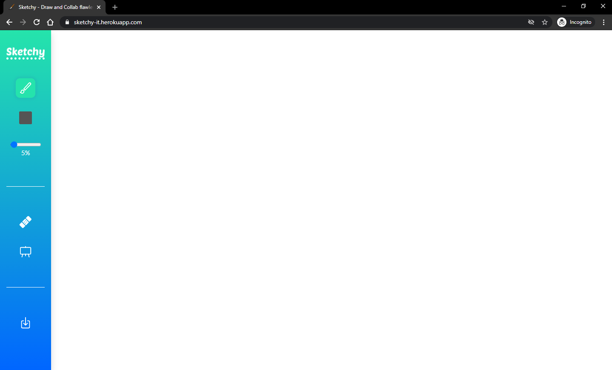
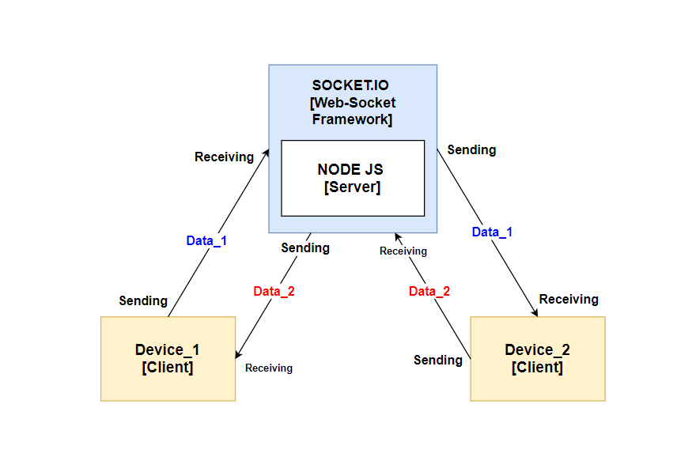

## [**Sketchy**](https://sketchy-it.herokuapp.com/)

Achieve real-time collaboration between multiple canvases while maintaining a secure connection.

<br>

## **Screenshot:**



---

<br>

## **Primary Objective:**

The primary objective of the project is to share canvas data among multiple users. The sketchy would help us to share our thoughts in a parallel architecture. While in one canvas you would perform the work, the remaining canvases should be able to render the activity enabling the users to view it.

<br>

## **Motive:**

This project acts as a medium of communication in various fields. This would satisfy the needs in teachings as it would be of utmost important to share a common blackboard. This would prove itself worthy in the presentation of projects where distant clients would be able to share the canvas to communicate.

<br>

## **Architecture:**



<br>

## **Prerequisites:**

-   Node v10.x or above.

<br>

## **Libraries:**

-   [Express](https://github.com/expressjs/express)
-   [Pickr](https://simonwep.github.io/pickr/)
-   Socket.io
-   [p5](https://p5js.org/)
-   [jQuery](https://jquery.com/)

<br>

## **How to Run:**

1. Clone the repository.
2. Install the Dependencies
    ```
    npm install or yarn install
    ```
3. Run the Server

    ```
    npm start or yarn start
    ```

4. Open **localhost:3000** in your browser and use it.

<br>

## **Team:**

1. [Debojyoti Dutta](https://github.com/DeboDevelop)
2. [Avirup Dutta](https://github.com/avirupdutta)
3. [Arkajit Roy](https://github.com/arkajitroy)
4. Sumit Marik
5. Abu Rehan Mondal
